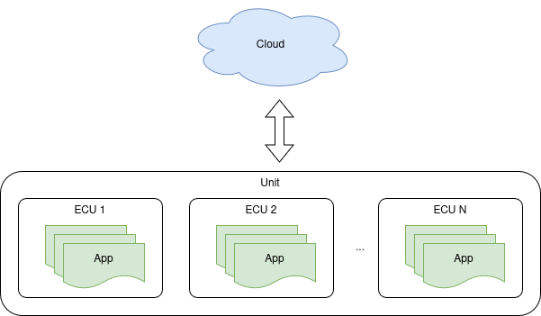
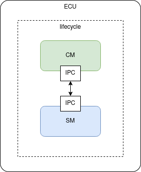
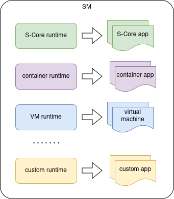
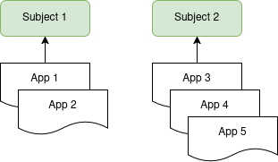
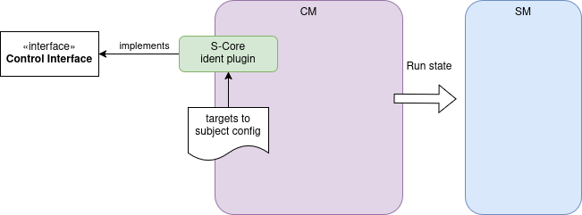

# Lifecycle module

## Overview

This document describes the architecture of AosCore, explains how it aligns with S-CORE requirements, and outlines its
applicability within the S-CORE environment.

Goal is to define how AosCore can be reused to enable flexible orchestration features in S-CORE.

## AosCore architecture

AosCore is designed to deploy various types of applications—including native, containerized, and virtualized workloads—
across a multi-ECU (Electronic Control Unit) system.

To support its multi-node (multi-ECU) architecture, AosCore implements lifecycle management functionality through two
distinct services:

* Communication Manager (CM): responsible for cloud communication and scheduling applications across nodes (ECUs).
  This service operates on one node (active).
* Service Manager (SM): responsible for launching applications on a specific node and monitoring the health of running
  applications. This service runs on each node (ECU) that is designated for application deployment.

The Communication Manager (CM) and Service Manager (SM) communicate with each other via an inter-process communication
(IPC) interface, which varies depending on the platform. On Linux systems, gRPC is used, while on QNX platforms,
communication is handled through SOME/IP (LoLa).

### Launching applications

Deployment (referred to as `Run state` in S-CORE) can be initiated either by the cloud or locally through static
configuration. The deployment also includes runtime dependencies configuration, which is used by the Communication
Manager (CM) to start applications in a specified order.

The Service Manager (SM) supports multiple runtimes (sandboxes) to launch various types of applications. Runtimes are
implemented as plugins, enabling easy integration of new application types.

Each runtime consists of the following components:

* `Image Manager`: deploys dedicated application images to the unit;
* `Runner`: starts applications of the specific type supported by the runtime;
* `Healthchecker`: monitors the health of applications launched by the runtime.

Examples:

* S-CORE Runtime:
  * the runner  utilizes the `Lifecycle interface` to launch S-CORE applications;
  * the healthchecker implements `Logical Monitor` and `Deadline Monitor` APIs.

* Container Runtime:
  * the runner uses `crun` to execute containerized applications;
  * the healthchecker monitors container application health by verifying if the process ID (PID) is active.

### Selecting Run Target

AosCore implements a subjects mechanism to associate applications with specific groups or events. Each application is
bound to a particular subject, which can be either remote or local. Local subjects are defined by the unit itself,
whereas remote subjects are provided by the cloud.

Switching between local subjects is managed through the dedicated plugin. To implement the selecting of `Run targets`
functionality, an S-CORE plugin should be developed. This plugin should implement the `Control Interface` and map each
dedicated S-CORE target to a specific AosCore subject. When a new target is requested, the plugin advertises the new
subject, and the Communication Manager (CM) sends a corresponding `Run State` request for the desired target state to
the Service Manager (SM).

## Summary

The proposed design requires the following components to enable the reuse of AosCore components as the S-CORE lifecycle
module:

* `S-CORE Runtime`, which includes:
  * `S-CORE Runner`: utilizes the `Lifecycle interface` to launch S-CORE applications;
  * `S-CORE Healthchecker`: implements `Logical` and `Deadline` Monitor APIs to monitor S-CORE applications health.
* `S-CORE identification Plugin`: maps S-CORE targets to AosCore subjects to facilitate switching between different
  `Run States`.

Additionally, AosCore supports running other types of applications, such as containers and virtual machines (VMs),
due to its runtime plugin architecture.

## Links

In order to try AosCore, follow this link:

https://docs.aosedge.tech/docs/quick-start/

The AosCore codebase is organized into several separate repositories. The AosCore library repository contains portable, POSIX-compatible code that implements the core functionality:

https://github.com/aosedge/aos_core_lib_cpp

Refer to the following link to access the Linux-specific code for the AosCore Service Manager (SM):

https://github.com/aosedge/aos_core_sm_cpp/

C++ CM code not yet published.
